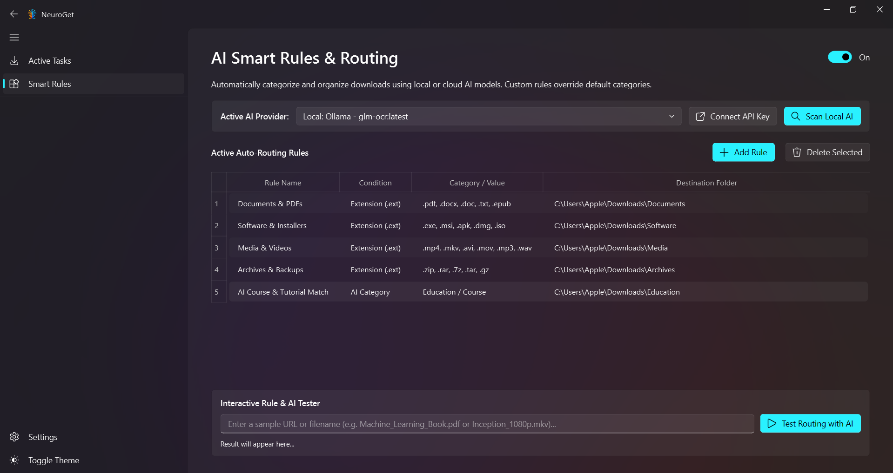
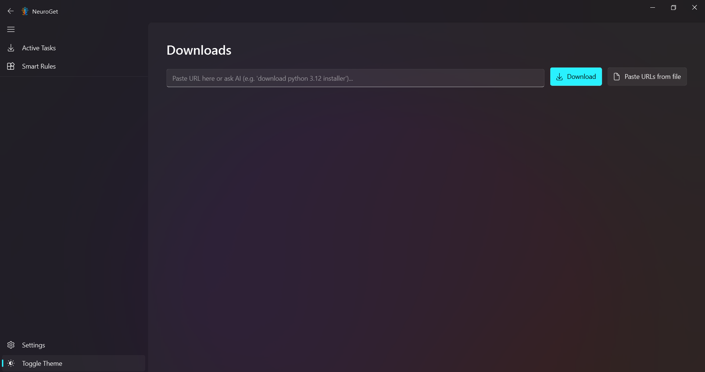
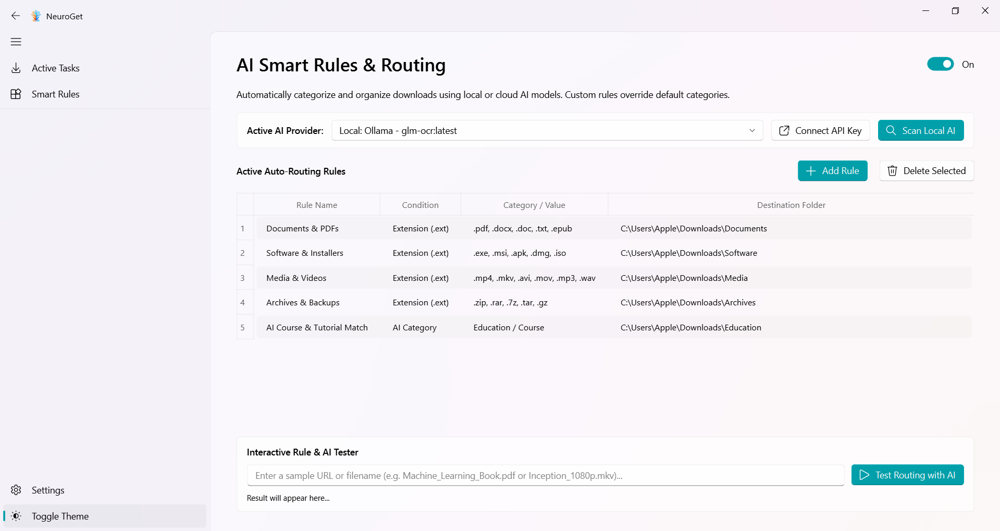
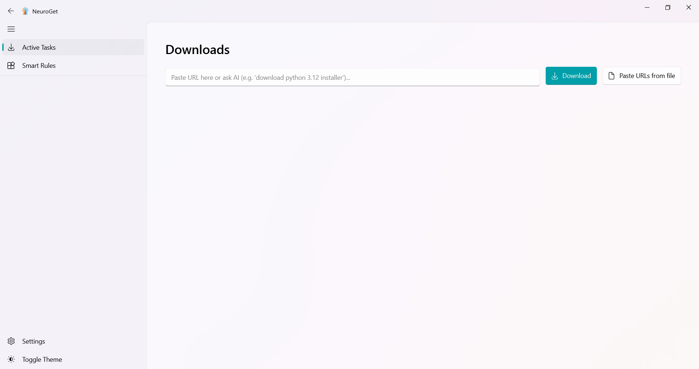
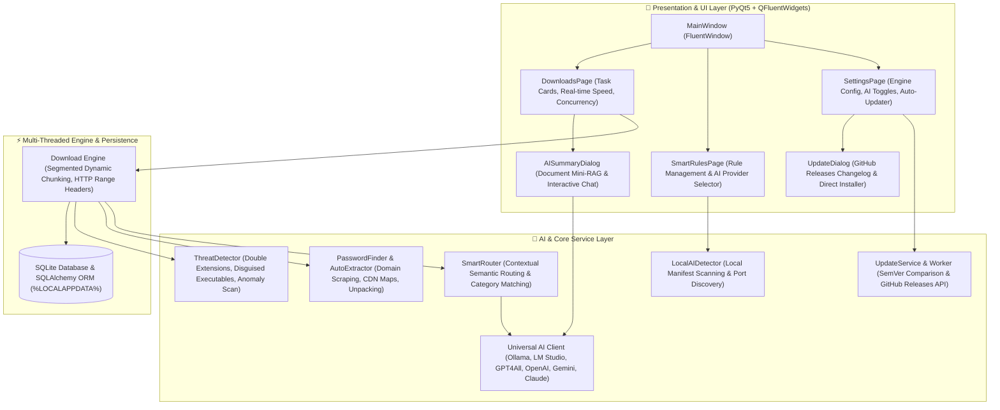

<p align="center">
  
  <h1 align="center">NeuroGet</h1>
  <p align="center">
    <strong>The State-of-the-Art AI-Powered Download Manager for Windows 11</strong>
    <br>
    <em>Intelligent Multi-Threaded Fetching • Semantic AI Routing • Document Mini-RAG • Threat Detection</em>
  </p>
  <p align="center">
    <a href="https://github.com/mohammadrezamirtaleb/NeuroGet/releases/latest"></a>
    
    
    
    
    
  </p>
</p>

---

## 📸 Interface Preview (2x2 Matrix)

<table align="center" width="100%">
  <tr>
    <td width="50%" align="center">
      <strong>Dark Mode — Active Downloads & Concurrency</strong><br><br>
      
    </td>
    <td width="50%" align="center">
      <strong>Dark Mode — Fluent Navigation & Controls</strong><br><br>
      
    </td>
  </tr>
  <tr>
    <td width="50%" align="center">
      <strong>Light Mode — Active Downloads & Real-Time Stats</strong><br><br>
      
    </td>
    <td width="50%" align="center">
      <strong>Light Mode — Fluent Navigation & Settings</strong><br><br>
      
    </td>
  </tr>
</table>

---

## 🌌 Overview

**NeuroGet** bridges the gap between raw multi-threaded networking and modern Artificial Intelligence. Engineered natively with **PyQt5** and styled according to the **Windows 11 Fluent Design System**, NeuroGet automates file organization, sanitizes file names, inspects threat payloads, extracts archive passwords, and allows you to interactively chat with downloaded documents via a local **Mini-RAG** engine.

---

## 🏗️ Software Architecture & Flowchart

NeuroGet is built upon an enterprise **Layered Model-View-Controller (MVC)** pattern with dedicated asynchronous `QThread` workers to guarantee a responsive, zero-freeze 60fps user experience.



---

## ⚡ Key Capabilities & Features

### 🚀 High-Speed Multi-Threaded Engine
* **Segmented Fetching:** Splits incoming files into dynamic byte-range chunks fetched simultaneously over concurrent HTTP connections (up to 32 threads).
* **Safe Resumption:** Incomplete files are safely written as `.part` files with verified byte offsets to prevent corruption upon network drops.
* **Smart Clipboard Sniffer:** Automatically identifies download links copied to the clipboard and presents an unobtrusive prompt to start downloading.

### 🧠 Universal AI Client (Local & Cloud LLMs)
* **Offline-First Local Discovery:** Automatically detects local models installed on disk (`~/.ollama/models/manifests`), supports LM Studio (`localhost:1234`), and GPT4All.
* **Cloud LLM Support:** Connects directly to OpenAI (GPT-4o), Google Gemini 1.5 Flash, Anthropic Claude 3.5 Sonnet, and OpenRouter.
* **100% Heuristic Fallbacks:** Zero dependency on internet connectivity or external APIs; all categorization and renaming tasks fall back smoothly to rule-based heuristics if no LLM is present.

### 📄 Content Analyzer & Document Mini-RAG
* **Instant Summaries:** Extracts key insights, reading times, and structured takeaways from PDFs, code files, text documents, subtitles, and archives.
* **Interactive Document Q&A:** Ask questions directly to your downloaded document inside a 3-tab Fluent dialog grounded in the file's content.

### 🧹 AI Clean Renaming
* **Tag & Prefix Stripper:** Automatically strips intrusive website tags, download tracker prefixes (e.g. `[Soft98.ir]`, `(Site.com)`), and messy query strings before saving to disk.

### 🛡️ Threat & Clickbait Detector
* **Disguised Executable Defense:** Analyzes incoming files for double extensions (e.g. `movie.mp4.exe`), misleading MIME types, and suspiciously small binary files disguised as media.

### 🔑 Smart Password Scraping & Auto-Extractor
* **Referrer & CDN Discovery:** Extracts extraction passwords by analyzing referrer headers, download hosts, and built-in Iranian & international software portal maps.
* **Background Unpacker:** Unpacks `.zip`, `.rar`, `.7z`, and `.tar` archives in the background upon download completion.

### 🔄 GitHub Releases Auto-Updater
* **SemVer Comparison:** Non-blocking background worker queries the [NeuroGet GitHub Releases API](https://github.com/mohammadrezamirtaleb/NeuroGet/releases) to compare semantic versions.
* **Fluent Update Dialog:** Displays formatted release notes, binary asset sizes, and one-click download buttons for `NeuroGet_Setup.exe`.

---

## 📂 Project Structure

```text
📁 NeuroGet/
├── 📄 main.py                      # Main entry point, Splash screen & MainWindow
├── 📄 requirements.txt              # Core Python dependencies
├── 📁 assets/                       # High-res logos, icons, and 2x2 screenshots
│   ├── 🖼️ logo_transparent.png     # Official transparent branding
│   ├── 🖼️ banner.png               # Dark Mode UI (Downloads)
│   ├── 🖼️ banner__menu.png         # Dark Mode UI (Navigation)
│   ├── 🖼️ banner_light.png         # Light Mode UI (Downloads)
│   └── 🖼️ banner_light_menu.png    # Light Mode UI (Navigation)
├── 📂 app/
│   ├── 📂 common/                  # Version definitions and global constants
│   │   ├── 📄 __init__.py
│   │   └── 📄 version.py           # v1.0.1 metadata & GitHub endpoints
│   ├── 📂 models/                  # Database models & SQLite storage
│   │   ├── 📄 database.py          # SQLAlchemy ORM session & queries
│   │   └── 📄 schemas.py           # DownloadTask, SmartRule, AppSetting
│   ├── 📂 controllers/             # Download management & multi-threading
│   │   ├── 📄 download_manager.py  # Thread scheduler & download queue
│   │   └── 📄 worker.py            # Segmented chunk downloader worker
│   ├── 📂 services/                # Business logic & AI sub-systems
│   │   ├── 📄 ai_client.py         # Multi-provider LLM & heuristic engine
│   │   ├── 📄 ai_scanner.py        # Local Ollama / LM Studio port & manifest scanner
│   │   ├── 📄 content_analyzer.py  # PDF/Text parser & Mini-RAG engine
│   │   ├── 📄 password_finder.py   # Domain scraper & archive auto-extractor
│   │   ├── 📄 router.py            # Semantic router & rule evaluator
│   │   ├── 📄 threat_detector.py   # Malware & clickbait anomaly detector
│   │   └── 📄 updater.py           # GitHub Releases updater & worker
│   └── 📂 views/                   # PyQt5 Fluent Design presentation layer
│       ├── 📄 splash_screen.py     # Custom animated startup splash
│       ├── 📂 pages/               # Main application pages
│       │   ├── 📄 downloads_page.py
│       │   ├── 📄 smart_rules_page.py
│       │   └── 📄 settings_page.py
│       └── 📂 components/          # Reusable UI widgets
│           ├── 📄 download_card.py # Dynamic download card
│           ├── 📄 ai_summary_dialog.py # Document Q&A and summary dialog
│           └── 📄 update_dialog.py # Windows 11 software update dialog
└── 📂 tests/                       # Complete automated test suite
    ├── 📄 test_ai_features.py      # AI, NLP, Threat & Extraction tests
    ├── 📄 test_ui_comprehensive.py # UI lifecycle, Workers, and Pages test
    └── 📄 test_updater.py          # SemVer, GitHub API, and Dialog tests
```

---

## 🛠️ Installation & Setup

### Prerequisites
- **Python 3.12+**
- **Windows 10 / Windows 11** (Optimized for Windows 11 Fluent Design)

### 1. Clone the Repository
```bash
git clone https://github.com/mohammadrezamirtaleb/NeuroGet.git
cd NeuroGet
```

### 2. Create and Activate Virtual Environment
```powershell
python -m venv venv
.\venv\Scripts\activate
```

### 3. Install Dependencies
```bash
pip install -r requirements.txt
```

### 4. Run the Application
```bash
python main.py
```

---

## 🧪 Running Automated Tests

NeuroGet includes an end-to-end test suite covering all UI components, background workers, AI endpoints, and update mechanics:

```powershell
# Run AI & Smart Features Test Suite
python tests/test_ai_features.py

# Run Auto-Updater & GitHub API Test Suite
python tests/test_updater.py

# Run Comprehensive UI & Worker Suite
python tests/test_ui_comprehensive.py
```

---

## 📄 License

This project is licensed under the **MIT License** — see the [LICENSE](LICENSE) file for details.

<p align="center">
  Crafted with precision for next-generation downloading. <br>
  <strong>NeuroGet © 2026 • Mohammadreza Mirtaleb & Mahdi Ajami</strong>
</p>
