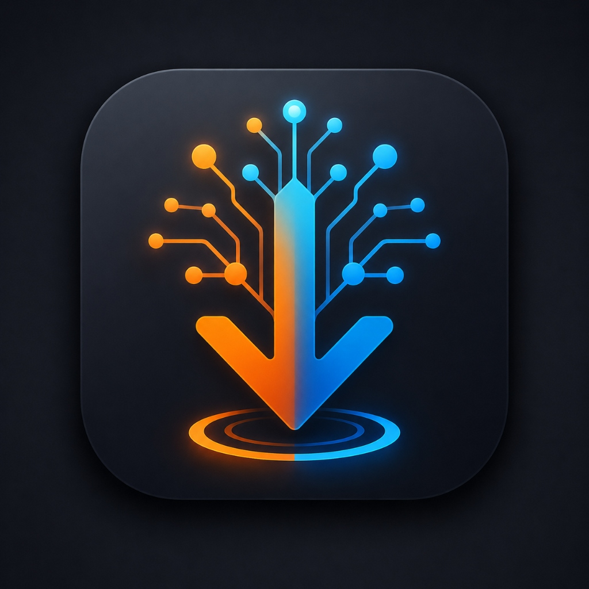

<p align="center">
  
  <h1 align="center">NeuroGet 🚀</h1>
  <p align="center">
    <strong>The Next-Generation AI-Powered Download Manager</strong>
    <br>
    <em>Intelligent Routing. Fluent Design. Uncompromised Speed.</em>
  </p>
  <p align="center">
    
    
    
    
  </p>
</p>

---

## 🌌 Overview

**NeuroGet** is not just another download manager. It is a state-of-the-art, AI-driven fetching engine wrapped in a breathtaking **Windows 11 Fluent Design** interface. 

By bridging the gap between traditional multi-threaded downloading and modern Artificial Intelligence, NeuroGet takes the manual work out of organizing your files, guessing extraction passwords, and managing tasks.

---

## ✨ Killer Features

### 🧠 AI Smart Routing
Stop organizing files manually. NeuroGet scans your downloads and uses **Artificial Intelligence** to automatically categorize and route files to specific destination folders based on contextual rules.
* **Local AI Support:** Auto-detects and connects to *Ollama, LM Studio*, and *GPT4All* entirely offline.
* **Cloud API Support:** Instantly connect to *OpenCode Zen, Anthropic, OpenAI, Google Gemini, OpenRouter*, and more.
* **Fallback System:** If AI is disabled or unavailable, it seamlessly falls back to your default folder without ever interrupting the download.

### 🔑 Smart Password Extractor
Downloading compressed archives (`.zip`, `.rar`) from the web? NeuroGet automatically analyzes the source domain and intelligently predicts the extraction password. 
* A dedicated **🔑 Password** button appears exclusively for archives.
* Instantly copy the most probable password to your clipboard with one click.

### 📋 Intelligent Clipboard Detection
NeuroGet actively monitors your clipboard. Copy a direct download link, and a sleek Fluent popup will elegantly ask for your confirmation before initiating the download. No annoying spam, just smart detection.

### 🎨 Breathtaking Fluent UI & UX
Built using `qfluentwidgets`, the UI is a visual masterpiece:
* **Custom Animated Splash Screen:** A frameless, shadow-casted loading screen with dynamic gradient progress bars and perfect typography.
* **Dark / Light Mode:** Fully native theme switching.
* **Dynamic Iconography:** Download cards automatically render matching UI icons (Music, Video, App, Archive) based on file extensions.

### 🗄️ Stateful Architecture (SQLite)
Your download history, smart rules, and preferences are safely stored in a local SQLite database using **SQLAlchemy (ORM)**. 
* Persistent state allows for flawless Pause/Resume capabilities.
* Dedicated **Data Management** settings to clear history or factory reset the application.

### ⚡ Zero UI Blocking (Threaded Core)
Engineered with a robust **Layered MVC Architecture**. All heavy lifting—from AI port scanning to network fetching—happens on isolated `QThread` background workers, guaranteeing a buttery-smooth 60fps UI experience.

---

## 📐 Architecture & Standards

NeuroGet strictly adheres to **Enterprise Software Standards**:

```text
📂 NeuroGet/
├── 📄 main.py                 # Application Entry Point & Splash Screen
├── 📄 setup_wizard.py         # Standalone GUI Installer Builder
├── 📁 assets/                 # Brand Assets, Logos, and Icons
└── 📂 app/
    ├── 📁 models/             # SQLAlchemy ORM, Schemas & SQLite DB
    ├── 📁 services/           # Business logic (AI Scanner, Password Finder)
    ├── 📁 controllers/        # Core Download Engine & Async HTTP Managers
    └── 📁 views/              # PyQt5 Fluent GUI (Pages, Components)
```

---

## 🚀 Getting Started

### Prerequisites
* Python 3.12+
* Windows 10 / 11 (Recommended for Fluent Design)

### Installation

1. **Clone the repository** (or extract the source):
   ```bash
   git clone https://github.com/yourusername/NeuroGet.git
   cd NeuroGet
   ```

2. **Create a virtual environment & install dependencies:**
   ```bash
   python -m venv venv
   .\venv\Scripts\activate
   pip install -r requirements.txt
   ```

3. **Launch NeuroGet:**
   ```bash
   python main.py
   ```

---

## 📸 Screenshots

*(Add your beautiful screenshots here!)*

<details>
<summary><b>Click to expand screenshots</b></summary>

| Dark Mode | Light Mode |
|-----------|------------|
| `[Screenshot 1]` | `[Screenshot 2]` |

| AI Smart Rules | Smart Password Finder |
|----------------|-----------------------|
| `[Screenshot 3]` | `[Screenshot 4]` |

</details>

---

<p align="center">
  Designed with passion. Ready for the future of downloading. <br>
  <b>NeuroGet © 2026</b>
</p>
